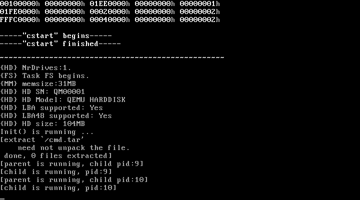
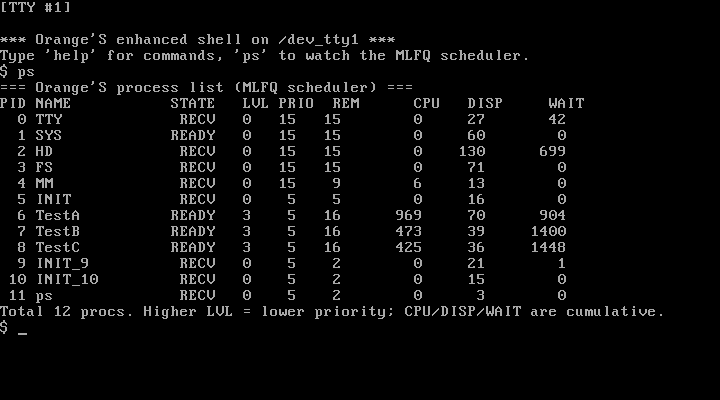
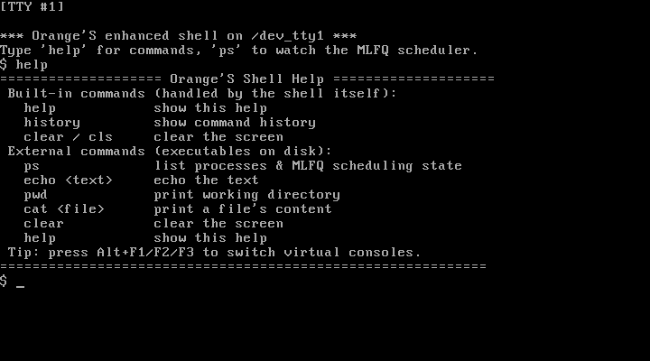
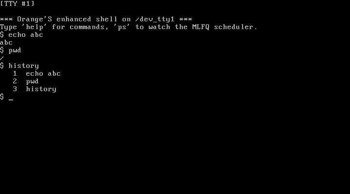
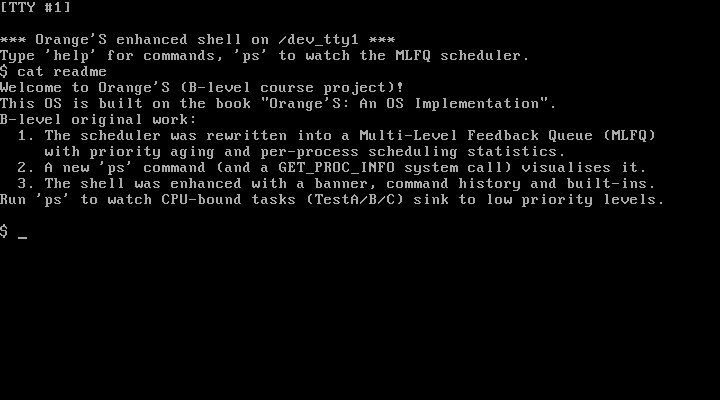
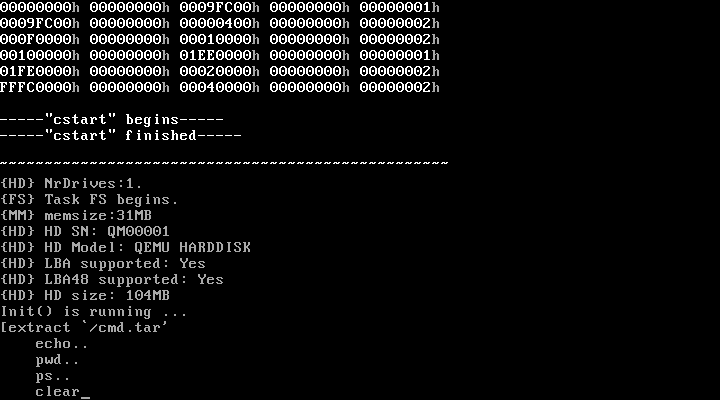

# Orange'S 操作系统课程设计项目文档

> **选题**:完成《Orange'S:一个操作系统的实现》项目要求
> **难度定位**:**B 级** —— 在 Orange'S 参考源码基础上**重写 / 大幅扩展核心模块**,新增代码量达到相关模块的一半以上
> **核心成果**:把原书简单的优先级调度器**重写为多级反馈队列(MLFQ)调度器**,并配套实现进程查看命令、增强 Shell、系统调用与若干系统命令

---

## 阅读导航

| 章节 | 内容 | 关键产出 |
|------|------|----------|
| [1. 项目概述](#1-项目概述) | 选题、目标、成果一览 | —— |
| [2. 开发环境搭建](#2-开发环境搭建) | WSL2 + 32 位交叉工具链 + QEMU | 可复现的构建/运行环境 |
| [3. Orange'S 系统架构](#3-oranges-系统架构概览) | 参考源码的整体结构 | 理解改造的基础 |
| [4. 原创工作详解](#4-原创工作详解) | **本项目的核心** | 见下表 |
| [4.1 进程调度器重写(MLFQ)](#41-进程调度器重写mlfq多级反馈队列) | 调度算法重写 + 老化 + 统计 | `proc.c` `clock.c` `proc.h` |
| [4.2 ps 命令与 GET_PROC_INFO 系统调用](#42-ps-命令与-get_proc_info-系统调用) | 进程信息系统调用 | `systask.c` `lib/getprocs.c` `command/ps.c` |
| [4.3 Shell 增强](#43-shell-增强) | 历史记录 + 内建命令 | `kernel/main.c` |
| [4.4 控制台清屏与 clear 命令](#44-控制台清屏与-clear-命令) | 控制台驱动增强 | `console.c` `command/clear.c` |
| [4.5 命令套件 help / cat](#45-命令套件-help--cat) | 系统命令 | `command/help.c` `command/cat.c` |
| [4.6 文件系统读越界 Bug 修复](#46-文件系统读越界-bug-修复) | FS 缺陷修复 | `fs/read_write.c` |
| [5. 编译与运行](#5-编译与运行) | 一键构建脚本说明 | —— |
| [6. 运行效果展示](#6-运行效果展示) | 截图与说明 | —— |
| [7. 遇到的问题与解决](#7-遇到的问题与解决) | 完整踩坑记录 | —— |
| [8. 工作量统计](#8-工作量统计) | 代码量、文件清单 | —— |
| [9. 心得体会](#9-心得体会) | —— | —— |

---

## 1. 项目概述

本项目以《Orange'S:一个操作系统的实现》(Forrest Yu)随书源码的**最终版本(`chapter11/c`)** 为基础进行二次开发。该版本本身已是一个功能完整的微内核操作系统,包含:引导扇区、保护模式内核、基于消息传递的进程间通信(IPC)、进程调度、时钟/键盘/TTY/控制台/硬盘驱动、内存管理(fork/exec/exit)、自研硬盘文件系统,以及一个极简 Shell。

按课程评分标准,**B 级**要求"对参考源码的一个或多个模块进行修改或者重新实现……新增代码量至少达到相关模块代码的一半"。本项目选择**进程调度子系统**作为主攻模块进行重写,并围绕"让调度行为可观测、可交互"这一目标,配套实现了一系列系统调用、Shell 增强与用户命令。

**原创工作一览:**

1. **进程调度器重写**:将原书"选剩余时间片最大者"的单级轮转调度,**重写为四级多级反馈队列(MLFQ)**,引入:
   - 时间片用尽即降级(CPU 密集型进程自动沉到低优先级);
   - 主动让出 CPU 的进程不降级(交互型进程保持高响应);
   - 周期性**优先级老化(boost)**,防止低优先级进程饿死;
   - 每进程**调度统计**(累计 CPU tick、被调度次数、累计等待 tick)。
2. **`ps` 命令 + `GET_PROC_INFO` 系统调用**:新增一条进入 `TASK_SYS` 的系统调用,把内核进程表快照拷贝到用户态,`ps` 命令将其格式化为表格,**直观展示 MLFQ 的运行效果**。
3. **Shell 增强**:为原 `shabby_shell` 增加欢迎横幅、**命令历史**、`history`/`clear`/`cls`/`exit` 内建命令以及更友好的"命令未找到"提示。
4. **控制台清屏能力**:在控制台驱动 `out_char()` 中实现换页符 `\f` 的清屏语义,并提供 `clear` 命令。
5. **命令套件**:新增 `ps`、`clear`、`help`、`cat` 等用户态命令。
6. **文件系统缺陷修复**:修复 `do_rdwt()` 读操作返回超过文件实际大小数据的越界缺陷。

**新增/改动代码约 492 行**(详见[第 8 节](#8-工作量统计)),其中调度子系统新增约 120 行,而原调度核心仅约 26 行,**新增量远超模块原代码的一半**,满足 B 级要求。

---

## 2. 开发环境搭建

原书面向 Linux + Bochs。本项目宿主机为 **Windows 11(中国区)**,最终采用 **WSL2 + Ubuntu 24.04** 作为构建环境,可在宿主机上通过 `wsl` 直接驱动编译与运行,既贴近原书又便于自动化。

### 2.1 安装 WSL2 与 Ubuntu

中国区 Windows 直接 `wsl --install` 会因访问微软商店被拒(报错 **403**)。解决办法:

1. 以管理员权限用 DISM 启用底层功能(本地组件,无需下载):
   ```powershell
   dism /online /enable-feature /featurename:Microsoft-Windows-Subsystem-Linux /all /norestart
   dism /online /enable-feature /featurename:VirtualMachinePlatform /all /norestart
   ```
   返回码 **3010** 表示成功但需重启。**重启电脑**。
2. WSL 存根仍走商店导致 403,故**从 GitHub 直接下载 WSL 独立安装包**绕开:
   下载 `https://github.com/microsoft/WSL/releases` 的 `wsl.2.7.8.0.x64.msi` 并 `msiexec /i ... /quiet` 安装。
3. 安装发行版:`wsl --install -d Ubuntu-24.04`。

### 2.2 安装 32 位交叉工具链

Orange'S 内核是 32 位保护模式程序,需要 32 位 ELF 工具链与 NASM、QEMU:

```bash
sudo apt-get update
sudo apt-get install -y build-essential gcc-multilib nasm \
                        qemu-system-x86 mtools netpbm bc
```

| 工具 | 用途 |
|------|------|
| `gcc -m32` | 编译 32 位内核/用户程序 |
| `nasm -f elf` | 汇编 32 位 ELF 目标文件 |
| `ld -m elf_i386` | 链接为 32 位内核镜像 |
| `qemu-system-i386` | 运行虚拟机 |
| `mtools(mcopy)` | 免挂载地把文件写入 FAT12 软盘镜像 |

### 2.3 让原 Makefile 适配 64 位宿主

原 `Makefile` 在 2005 年的 32 位 gcc 上编写,在现代 64 位 gcc(13.x)上需三处调整:

| 位置 | 改动 | 原因 |
|------|------|------|
| `CFLAGS` | 加 `-m32 -fno-stack-protector -fno-pie -fcommon` | 生成 32 位代码;关闭栈保护/PIE;`-fcommon` 兼容老代码"头文件中暂定义全局变量"的写法(gcc 10+ 默认 `-fno-common` 会报 `multiple definition`) |
| `LDFLAGS` | 加 `-m elf_i386` | 链接为 32 位 ELF |
| `buildimg` | 用 `mcopy` 替换 `sudo mount` | 现代环境免挂载、免 root 地写入软盘镜像 |

> 详细的踩坑过程见[第 7 节](#7-遇到的问题与解决)。

---

## 3. Orange'S 系统架构概览

理解改造前,先速览参考系统的进程模型(这是调度器改造的对象):

- **任务(TASK)与进程(PROC)统一**用 `proc_table[]` 管理,共 `NR_TASKS(5)+NR_PROCS(32)` 个槽位。
- 系统**任务**:`TTY`、`SYS`、`HD`、`FS`、`MM`(分别负责终端、系统服务、硬盘、文件系统、内存)。
- 初始**进程**:`INIT`(再 fork 出两个 Shell,分别运行在 `tty1`/`tty2`)、`TestA/TestB/TestC`(三个 `for(;;);` 死循环,正好用作 CPU 密集型负载来演示调度)。
- 进程靠**消息传递**通信:`send_recv()` 阻塞式收发,大多数"系统调用"(open/read/getpid/fork…)其实是给相应任务发消息。
- **调度时机**:时钟中断 `clock_handler()` 每 tick 递减当前进程时间片,用尽则调用 `schedule()` 重新选择。

进程控制块 `struct proc`(`include/sys/proc.h`)开头是 `regs`(被汇编保存/恢复现场,偏移被 `sconst.inc` 硬编码),其后是 `ldt_sel`、`ldts`、`ticks`、`priority`、`p_flags`、文件描述符表等。

> ⚠️ **关键约束**:`sconst.inc` 硬编码了 `regs`、`ldt_sel`(偏移 76)、`ldts`(偏移 80)。因此**新增的 PCB 字段必须追加到 `struct proc` 末尾**,绝不能插在 `ldts` 之前,否则会破坏汇编保存现场的逻辑。本项目所有新增字段都遵守此约束。

---

## 4. 原创工作详解

### 4.1 进程调度器重写(MLFQ 多级反馈队列)

#### 4.1.1 原调度器

原 `schedule()`(`kernel/proc.c`)只有约 26 行,逻辑是"**所有就绪进程里选剩余时间片(ticks)最大的运行;若都为 0,则用各自 priority 重新充值**"。这是一种单级、近似轮转的调度,**无优先级分层、无防饿死、无任何统计**,也无法区分交互型与计算型进程。

#### 4.1.2 新调度器设计

重写为 **4 级多级反馈队列(MLFQ)**,规则:

1. **分层**:`NR_SCHED_LEVELS = 4`,第 0 层优先级最高;第 `lvl` 层时间片 `SCHED_QUANTUM(lvl) = 2 << lvl`,即 2 / 4 / 8 / 16 个 tick(越低优先级时间片越长)。
2. **选择**:`schedule()` 从第 0 层向下扫描,在**第一个存在就绪且仍有时间片进程的层级**内做 Round-Robin(从当前进程的下一个槽位环形查找),保证同层公平。
3. **降级**:进程**用完整个时间片**(说明是 CPU 密集型)→ 降到下一层。降级只发生在 `clock_handler` 检测到时间片耗尽时。
4. **不降级**:**主动阻塞**(收发消息、读键盘)而让出 CPU 的进程保留所在层级 —— 因此交互型 Shell 始终停留在高层,响应迅速。
5. **老化(防饿死)**:每隔 `SCHED_BOOST_TICKS(300)` 个 tick,`sched_boost()` 把所有进程提回第 0 层(MLFQ 规则 5),避免低层进程被饿死。
6. **系统任务豁免**:`is_user==0` 的系统任务**不参与降级**,始终保持最高优先级,保证 IPC 与驱动的实时性(它们本就很快阻塞,极少占满时间片)。

#### 4.1.3 PCB 扩展(`include/sys/proc.h`,追加到结构体末尾)

```c
int  sched_level;   /* 当前所在 MLFQ 层级,0 为最高优先级 */
int  is_user;       /* 1=用户进程(参与降级),0=系统任务 */
u32  cpu_ticks;     /* 累计占用 CPU 的 tick 数(统计) */
u32  n_dispatch;    /* 被调度器选中运行的累计次数(统计) */
u32  wait_ticks;    /* 处于就绪态但未获得 CPU 的累计 tick(统计) */
```

#### 4.1.4 核心代码(`kernel/proc.c`)

```c
PUBLIC void schedule()
{
    struct proc* p;  int level;
    int n = NR_TASKS + NR_PROCS;
    int start = (int)(p_proc_ready - proc_table);   /* 上次运行者,用于轮转 */

    for (;;) {
        for (level = 0; level < NR_SCHED_LEVELS; level++) {  /* 高优先级层优先 */
            int i;
            for (i = 1; i <= n; i++) {                       /* Round-Robin */
                p = &proc_table[(start + i) % n];
                if (p->p_flags == 0 && p->ticks > 0 && p->sched_level == level) {
                    p_proc_ready = p;  p->n_dispatch++;  return;
                }
            }
        }
        /* 所有就绪进程时间片都用尽 -> 按各自层级重新发放时间片 */
        for (p = &FIRST_PROC; p <= &LAST_PROC; p++)
            if (p->p_flags == 0) p->ticks = SCHED_QUANTUM(p->sched_level);
    }
}

PUBLIC void sched_boost()   /* 优先级老化:把所有活动进程提回第 0 层 */
{
    struct proc* p;
    for (p = &FIRST_PROC; p <= &LAST_PROC; p++)
        if (!(p->p_flags & FREE_SLOT)) p->sched_level = 0;
}
```

#### 4.1.5 时钟中断中的统计、老化与降级(`kernel/clock.c`)

```c
/* 统计:运行者累计 CPU,其余就绪者累计等待 */
if (p_proc_ready->p_flags == 0) p_proc_ready->cpu_ticks++;
for (q = &FIRST_PROC; q <= &LAST_PROC; q++)
    if (q->p_flags == 0 && q != p_proc_ready) q->wait_ticks++;

if (p_proc_ready->ticks) p_proc_ready->ticks--;
... /* 键盘、k_reenter 判断同原版 */

/* 老化:周期性提升所有进程 */
if (ticks % SCHED_BOOST_TICKS == 0) sched_boost();

if (p_proc_ready->ticks > 0) return;     /* 时间片未用完,继续运行 */

/* 时间片用尽 -> 用户进程降级,并按新层级补充时间片 */
if (p_proc_ready->is_user && p_proc_ready->sched_level < NR_SCHED_LEVELS - 1)
    p_proc_ready->sched_level++;
p_proc_ready->ticks = SCHED_QUANTUM(p_proc_ready->sched_level);
schedule();
```

字段在 `kernel_main()` 初始化(系统任务 `is_user=0`、用户进程 `is_user=1`,均从第 0 层起步),并在 `do_fork()` 中为子进程重置(子进程从第 0 层、零统计开始)。

#### 4.1.6 效果

运行 `ps` 可见:三个死循环 `TestA/B/C` 已从第 0 层**降级到第 3 层**且累计 CPU 很高;系统任务与交互 Shell 仍停留在第 0 层(见 [6.2](#62-ps-展示-mlfq-调度核心成果))。这正是 MLFQ 的教科书式行为。

---

### 4.2 ps 命令与 GET_PROC_INFO 系统调用

为了让调度行为"看得见",新增一条系统调用把内核进程表导出到用户态。

- **消息类型**:`include/sys/const.h` 的 `enum msgtype` 中新增 `GET_PROC_INFO`。
- **用户态数据结构**:`include/stdio.h` 新增 `struct proc_info`(pid、name、状态、层级、优先级、剩余时间片、累计 CPU/调度次数/等待 tick),为内核与用户共享。
- **内核处理**:`kernel/systask.c` 的 `task_sys` 增加分支,调用 `get_proc_info()` 遍历 `proc_table`,跳过空闲槽位,填充 `proc_info` 数组,再用 `phys_copy` + `va2la` 拷贝到调用者地址空间,返回条目数。
- **库封装**:`lib/getprocs.c` 的 `get_procs(buf, max)` 向 `TASK_SYS` 发送 `GET_PROC_INFO` 消息(仿照 `getpid`/`stat` 的写法)。
- **命令**:`command/ps.c` 调用 `get_procs()` 并格式化为对齐表格输出。

数据流:`ps`(用户) → `get_procs()` → `send_recv` → `TASK_SYS` → 拷回进程表 → `ps` 打印。

---

### 4.3 Shell 增强

原 `shabby_shell`(`kernel/main.c`)只能读一行、找同名文件并 fork/exec。增强后:

- **欢迎横幅**:启动时打印 `*** Orange'S enhanced shell on /dev_ttyN ***` 与使用提示。
- **命令历史**:每个 Shell 进程用环形缓冲保存最近 10 条命令(在就地解析破坏输入行之前先保存原始命令行)。
- **内建命令**(必须在 Shell 进程内执行的命令):
  - `clear` / `cls`:向标准输出写 `\f` 触发内核清屏;
  - `history`:列出历史命令及序号;
  - `exit`:退出当前 Shell。
- **更友好的提示**:未找到命令时输出 `command not found: xxx`(原版输出 `{...}`)。

> 关于"上下方向键调出历史":Orange'S 的 TTY 为行缓冲熟模式,方向键在未按 Shift 时不下传到读取进程,要支持方向键回溯需改造 TTY 进入原始模式,改动面较大且易引入回归。本项目选择更稳妥的 `history` 命令方案,在不破坏 TTY 行编辑的前提下提供历史能力。

---

### 4.4 控制台清屏与 clear 命令

控制台驱动 `kernel/console.c::out_char()` 原本只处理 `\n` 和 `\b`。新增对换页符 `\f`(0x0C) 的处理:把当前控制台显存区域全部填为空格、光标与显示起点复位到左上角、清除 `is_full` 标志。这样:

- 内建 `clear`/`cls` 与外部 `clear` 命令只需输出一个 `\f` 即可清屏;
- 不依赖 ANSI 转义(VGA 文本模式不支持),实现干净。

---

### 4.5 命令套件 help / cat

- **`help`**(`command/help.c`):列出全部内建与外部命令及用途(纯 ASCII,VGA 文本模式可正常显示)。
- **`cat`**(`command/cat.c`):打开 `argv[1]` 指定文件,循环 `read` 并用 `write(1,…)` 原样输出(二进制安全);处理"无参数"与"打不开"两种错误。
- 另在 `cmd.tar` 中放入文本文件 `readme` 用于演示 `cat readme`。

> ⚠️ `cat` 的正确性依赖[第 4.6 节](#46-文件系统读越界-bug-修复)对 FS 读操作的修复,否则会读到文件尾部所在扇区的残留字节(其中的控制字符还会扰乱屏幕)。

---

### 4.6 文件系统读越界 Bug 修复

**问题**:`fs/read_write.c::do_rdwt()` 的读分支虽然把 `pos_end` 限制为 `min(pos+len, i_size)`,但每轮实际拷贝的 `bytes = min(bytes_left, chunk*SECTOR_SIZE - off)` 中,`bytes_left` 直接取请求长度 `len`,**没有按文件实际大小截断**。于是读一个 492 字节的文件会返回**整整一个扇区(512 字节)**,把文件尾部之后的扇区残留数据也带出来。`cat` 因此会输出 EOF 之后的垃圾(其中若含 `0x0C` 还会清屏)。`exec` 因为按 ELF 结构读取而未暴露此问题,所以平时不易察觉。

**修复**:把读操作的可读字节数限制为 `pos_end - pos`(即 `min(len, i_size - pos)`):

```c
/* fs/read_write.c::do_rdwt() */
int bytes_left = (fs_msg.type == READ) ? (pos_end - pos) : len;
```

修复后 `read()` 在文件结尾正确返回实际字节数,`cat readme` 输出干净(见 [6.4](#64-cat-读取文件文件系统修复验证))。

---

## 5. 编译与运行

### 5.1 目录与脚本

| 文件 | 作用 |
|------|------|
| `build_all.sh` | 一键构建:编译内核 + 用户命令,打包 `cmd.tar` 写入磁盘安装区,并清零超级块以强制重新 `mkfs` |
| `build_kernel.sh` | 仅重建内核与启动软盘(命令/磁盘不动,用于内核迭代,启动快) |
| `run_shot.sh` | 在 QEMU 中无界面启动,定时通过监视器 `screendump` 截图(开发期自动化验证用) |

### 5.2 构建与运行

```bash
# 完整构建(改动了命令时):
bash build_all.sh

# 仅改内核时:
bash build_kernel.sh

# 运行(图形界面):
cd /mnt/c/osbuild/orangeS
qemu-system-i386 -m 32 -boot a \
  -drive file=a.img,if=floppy,format=raw \
  -drive file=100m.img,format=raw,media=disk
```

> **首次启动较慢**:若执行了 `build_all.sh`(清零超级块),首次启动会触发 `mkfs` 并把 `cmd.tar` 解包成各命令文件。受 QEMU IDE PIO 中断时延影响,解包约需 1~2 分钟(详见 [7.7](#77-首次启动解包很慢))。**解包完成后会持久化到磁盘镜像,之后启动只需数秒。**

### 5.3 操作提示

- **Alt+F1 / F2 / F3**:在三个虚拟控制台间切换。Shell 运行在 **tty1(Alt+F2)** 与 **tty2(Alt+F3)**;tty0 是内核日志控制台。
- 在 Shell 中输入 `help` 查看命令,输入 `ps` 观察调度。

---

## 6. 运行效果展示

### 6.1 系统启动
内核完成内存检测、保护模式、硬盘识别(QEMU HARDDISK,支持 LBA48)、文件系统与内存管理初始化,`INIT` fork 出两个 Shell。



### 6.2 ps 展示 MLFQ 调度(核心成果)
`TestA/B/C` 三个 CPU 密集型死循环已被**降级到第 3 层(LVL=3)**,累计 CPU(CPU 列)很高;系统任务(TTY/SYS/HD/FS/MM)与交互 Shell、ps 自身停留在**第 0 层**。这直观证明了 MLFQ"计算型沉底、交互型保持高优先级"的行为。



### 6.3 增强 Shell 与 help / history
欢迎横幅、`help` 命令输出、`history` 列出历史命令:





### 6.4 cat 读取文件(文件系统修复验证)
`cat readme` 干净地输出文本文件内容,验证了 FS 读越界修复。



### 6.5 首次 mkfs 与解包过程
首次启动触发 `mkfs` 并逐个解包命令文件。



---

## 7. 遇到的问题与解决

> 本节如实记录开发过程中的关键问题与排查思路,对应实验报告"实验中遇到的问题及解决方法"。

### 7.1 中国区 `wsl --install` 报错 403
商店通道被拒。改用 **DISM 启用功能 + 从 GitHub 下载 WSL 独立 MSI** 绕开(见 [2.1](#21-安装-wsl2-与-ubuntu))。

### 7.2 64 位 gcc 链接报 `multiple definition`
gcc 10+ 默认 `-fno-common`,而 2005 年的代码在头文件中以"暂定义"方式定义全局变量(如 `PARTITION_ENTRY`),被多个 `.c` 包含即冲突。加 **`-fcommon`** 恢复旧语义即可。

### 7.3 默认生成 64 位代码 / PIE
现代 gcc 默认 64 位且开启 PIE。需 `-m32`、`ld -m elf_i386`、`-fno-pie`、`-fno-stack-protector`,使其生成可被原引导程序加载的 32 位非 PIE 代码。

### 7.4 构建镜像依赖 `sudo mount`
原 `buildimg` 用 `mount /mnt/floppy` 把文件拷进软盘镜像,需 root 且依赖挂载点。改用 **`mtools` 的 `mcopy -i a.img file ::/`** 免挂载写入,既快又无需 root。

### 7.5 Windows 换行符(CRLF)破坏脚本/Makefile
在 Windows 侧编辑的 `Makefile`/脚本带 CRLF,会让 `make` 报 `missing separator`、让 bash 报错。统一在构建脚本里先 `sed -i 's/\r$//'` 清理。

### 7.6 Alt+F1 切不到 Shell
最初按 Alt+F1 想切到 Shell 却没反应。阅读 `tty.c` 发现 `select_console(raw_code - F1)`:**F1→控制台 0**(正是日志台),Shell 在 tty1/tty2,应按 **Alt+F2 / Alt+F3**。

### 7.7 首次启动解包很慢
`mkfs` + 解包 `cmd.tar` 期间每个文件耗时约 10 秒。排查确认硬盘驱动是中断驱动(`interrupt_wait`),EOI 处理也正确;根因是 **QEMU 模拟 IDE 的 PIO 逐扇区中断时延**。该开销**仅一次性发生在首次 `mkfs`**,解包结果持久化后,后续启动只需数秒。开发期通过"内核改动只重建内核、不重新解包"的 `build_kernel.sh` 规避。

### 7.8 cat 读文件后屏幕变黑
排查发现是 `do_rdwt()` 读操作返回了超过文件实际大小的整扇区数据,尾部残留字节里含 `0x0C` 触发清屏。定位到 `bytes_left` 未按文件大小截断,修复见 [4.6](#46-文件系统读越界-bug-修复)。这也是一次"现象(黑屏)→ 假设(读越界)→ 用脚本解析磁盘 inode 验证 `i_size` → 定位并修复"的完整调试。

---

## 8. 工作量统计

### 8.1 代码量(相对原 `chapter11/c`)

| 文件 | 新增行 | 说明 |
|------|--------|------|
| `kernel/proc.c` | +50 | MLFQ `schedule()` 重写、`sched_boost()` |
| `kernel/clock.c` | +34 | 调度统计、老化、降级 |
| `include/sys/proc.h` | +32 | PCB 字段、MLFQ 配置宏 |
| `kernel/main.c` | +60 | 调度字段初始化、Shell 增强 |
| `mm/forkexit.c` | +11 | 子进程调度状态重置 |
| `kernel/systask.c` | +56 | `GET_PROC_INFO` 处理 |
| `kernel/console.c` | +13 | `\f` 清屏 |
| `include/stdio.h` | +22 | `proc_info` 结构与原型 |
| `fs/read_write.c` | +9 | 读越界修复 |
| `include/sys/{const,proto}.h` | +2 | 消息类型/原型 |
| `Makefile` / `command/Makefile` | +32 | 64 位适配、新命令构建 |
| **新文件** `lib/getprocs.c` | 47 | `get_procs()` |
| **新文件** `command/ps.c` | 58 | ps 命令 |
| **新文件** `command/{clear,help,cat}.c` | 66 | 三个命令 |
| **合计** | **≈ 492 行** | —— |

调度子系统(`proc.c`/`clock.c`/`proc.h` 相关部分)新增约 120 行,而原调度核心仅约 26 行,**新增量远超原模块的一半**,满足 B 级标准。

### 8.2 改动文件清单

- **内核**:`kernel/proc.c`、`kernel/clock.c`、`kernel/main.c`、`kernel/systask.c`、`kernel/console.c`
- **内存/文件系统**:`mm/forkexit.c`、`fs/read_write.c`
- **头文件**:`include/sys/proc.h`、`include/sys/const.h`、`include/sys/proto.h`、`include/stdio.h`
- **库**:`lib/getprocs.c`(新)
- **命令**:`command/ps.c`、`command/clear.c`、`command/help.c`、`command/cat.c`(均新)
- **构建**:`Makefile`、`command/Makefile`

---

## 9. 心得体会

1. **"读懂"比"改动"更花时间**。在动手前先理清 IPC 消息流、调度时机、PCB 内存布局(尤其是汇编硬编码的字段偏移),才能安全地扩展结构体、在正确的位置插入逻辑。MLFQ 本身不难,难在让它和原有的"时间片在时钟中断里递减、用尽才调度"机制严丝合缝地配合。

2. **可观测性是系统开发的一等公民**。如果没有 `ps`,MLFQ 改得对不对只能靠脑补;有了 `ps` 把层级、CPU、等待时间打印出来,降级与老化是否生效一目了然,调试与答辩都事半功倍。这也促成了一条完整的"系统调用 + 库封装 + 用户命令"链路实现。

3. **现代工具链跑老代码 = 一连串兼容性问题**。`-fcommon`、`-m32`、`-no-pie`、CRLF、`mount`→`mtools`……每一个都不难,但叠加起来很能消耗耐心。把这些固化进构建脚本,才能获得稳定可复现的环境。

4. **现象未必等于根因**。"cat 后黑屏"看似是 cat 的 bug,深挖却是文件系统读操作的越界缺陷;借助"用脚本直接解析磁盘上的超级块与 inode"这一手段,才把 `i_size` 这个关键证据挖出来。系统级调试,要善于绕到内核数据结构层面去取证。

---

*文档完*
